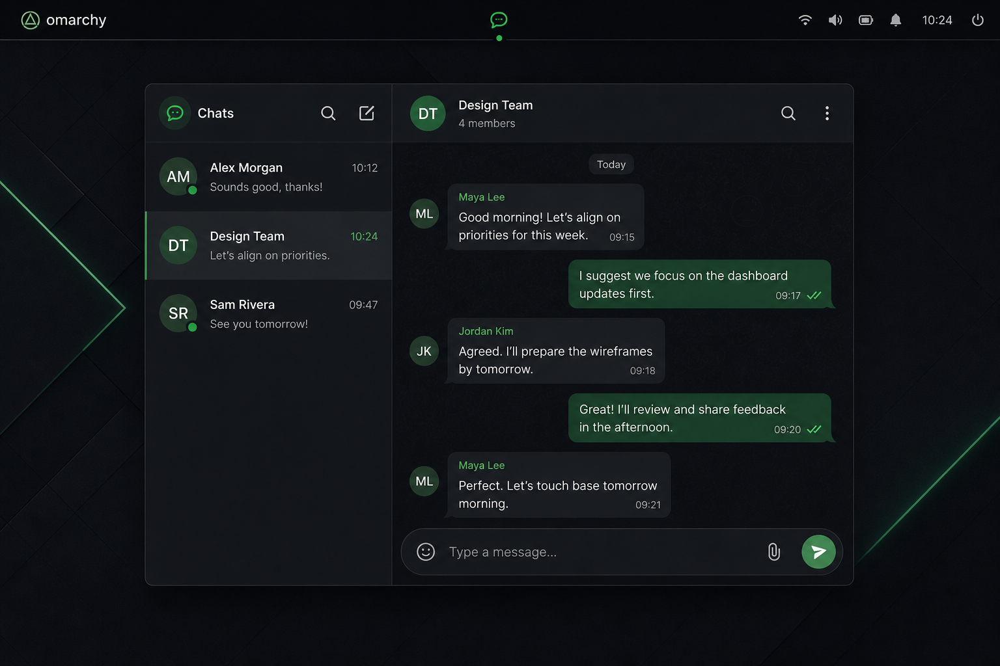

# Omarchy WhatsApp

A low-footprint WhatsApp linked-device client built for Omarchy. The complete
interface is a Quickshell service, bar widget, and on-demand app panel; a small
Rust daemon owns the connection, local history, and native notifications. There
is no Chromium, Electron, WebKit, or GTK UI process.



This project is unofficial and is not affiliated with or endorsed by WhatsApp
or Meta. It uses the reverse-engineered WhatsApp Web linked-device protocol via
[`whatsapp-rust`](https://github.com/oxidezap/whatsapp-rust). Protocol changes or
account policy enforcement can break unofficial clients; use it with that in
mind.

## What is included

- `omarchy-whatsappd`: persistent Rust daemon, SQLite session/history, Unix IPC,
  synchronized chat state, read receipts, private media caches, avatars, and
  native desktop notifications.
- `io.github.bryantebeek.whatsapp`: the full Quickshell app. Its service
  keeps lightweight UI state, its bar widget shows connection/unread state, and
  its panel provides pairing, chats, history, composing, and deep links.
- `omarchy-whatsappctl`: scriptable status, history, send, poll, and read
  operations.
- A hardened user systemd service, launcher entry, scalable icon, installer,
  uninstaller, and Arch `PKGBUILD`.

## Current app state

- **Conversations:** search names, recent-message previews, and JIDs; keep an
  unread-only filter between launches; start a direct chat from a phone number
  or JID; and pin or unpin chats. The list reflects synchronized
  pinned and muted state, unread counts, avatars, typing/recording activity, and
  message previews. Group headers show participant summaries.
- **Text and interaction:** send text through a durable, idempotent outbox;
  retry or discard a failed send; mark visible conversations read; inspect
  sent, delivered, read, and played receipts (including participant detail in
  groups); and add, change, or remove emoji reactions. History uses local date
  dividers and preserves the reader position while older or incoming messages
  are added.
- **Polls and voice notes:** create single- or multiple-answer polls, see live
  vote totals, and cast or revise a vote. Record Ogg Opus voice notes and retry
  interrupted sends; received voice notes download on demand and play inline.
- **Media:** render encrypted images and videos with in-app preview or playback,
  voice and regular audio, documents with open/save actions, static locations
  and final snapshots of live-location shares, and static or animated WebP stickers. Sticker downloads start when
  their conversation loads. Lottie stickers use only their embedded static
  preview, so sender-controlled animation JSON is not loaded into Qt's
  in-process Lottie renderer.
- **Presence and shell integration:** show online and last-seen presence plus
  direct and group typing/recording indicators; publish local availability and
  composer activity only after reconnect catch-up finishes, keeping the linked
  device unavailable during background sync; open location cards in
  OpenStreetMap; deep-link from native notifications and Omarchy search; and
  expose connection/unread state in the bar widget.
- **Recovery:** reconnect automatically, recover durable incoming work, text
  sends, voice sends, and read intents across interruptions, and offer a manual
  chat-state resync for unread, pinned, archived, and muted state without
  clearing the linked account or local history.

Calls, message-content search, group administration, replies/forwarding/editing,
and outbound attachments other than recorded voice notes are not yet
implemented. The roadmap below separates package-backed work from app-specific
scope.

## Roadmap

This roadmap tracks user-facing capabilities exposed by the pinned
`whatsapp-rust` release that are not yet available end-to-end through the
daemon, IPC protocol, and Quickshell interface. A synchronized setting or a
text placeholder does not count as complete until the user can inspect and
operate it in this app.

The order is directional rather than a release promise. Each item also needs
the corresponding Rust, IPC, QML, workflow, coverage, mutation, packaging, and
live-deployment work required by this repository's quality gates.

### Rich messaging

- [ ] Upload and send images, videos, GIFs, documents, and regular audio.
- [x] Record, upload, and send Ogg Opus voice notes, including recording-state
  updates, idempotent retry, crash recovery, and private local-cache retention.
- [ ] Reply to and quote messages, including group-participant context.
- [ ] Compose user and group mentions.
- [ ] Forward existing text and media messages with the correct forwarded
  metadata.
- [ ] Edit sent messages.
- [ ] Delete a message for everyone, including group-admin revocation where
  permitted.
- [ ] Delete a message only for this account and optionally remove its cached
  media.
- [ ] Keep or unkeep messages in disappearing chats.
- [ ] Pin and unpin individual messages, with supported pin durations.
- [ ] Send played receipts after voice and video messages are actually played.
- [x] Render and automatically download static and animated WebP stickers, with
  private PNG previews and accessibility-label fallbacks.
- [ ] Render Lottie sticker animation in a sandboxed helper. Until then, show
  its embedded PNG preview rather than loading untrusted animation JSON in the
  shell process.
- [ ] Fetch first-party sticker packs and create, upload, and send custom
  sticker packs.
- [ ] Create structured events with descriptions, times, locations, call
  links, and guest policy; render events and send RSVP responses.
- [ ] Render and send encrypted comments on Community Announcement posts.
- [ ] Add structured handling for contact cards and group invites instead of
  reducing them to text placeholders.
- [ ] Add outbound contact-card, static-location, and live-location messages
  through the package's generic message API.

### Chats, history, and organization

- [ ] Archive and unarchive chats.
- [ ] Mute, timed-mute, and unmute chats.
- [ ] Star and unstar messages, and expose a starred-message view.
- [ ] Mark chats unread as well as read.
- [ ] Delete chats and clear chat history, with explicit starred-message and
  cached-media choices.
- [ ] Mute and unmute individual contacts' status updates.
- [ ] Save or rename contacts and optionally synchronize them to the primary
  phone address book.
- [ ] Create, rename, recolor, and delete labels.
- [ ] Associate and disassociate labels with chats, then expose label filtering
  in the interface.
- [ ] Configure the account-default disappearing-message duration.
- [ ] Configure disappearing messages for direct chats and groups.
- [ ] Apply disappearing-message settings and expiry to local history end to
  end.

### Contacts, profiles, safety, and privacy

- [ ] Check whether a phone number is registered on WhatsApp before opening a
  new conversation.
- [ ] Show full contact information, about text, full-size profile pictures,
  verified names, and business profiles.
- [ ] Change this account's push name, about/status text, and profile picture,
  including picture removal.
- [ ] Block and unblock contacts, list blocked contacts, and show blocked state.
- [ ] Report direct or group messages as spam with the available report flows.
- [ ] Fetch and edit last-seen, online, profile-photo, about/status, group-add,
  read-receipt, call-add, message, and defense-mode privacy settings.
- [ ] Manage per-contact privacy exclusion lists for supported categories.

### Groups

- [ ] Create and leave groups.
- [ ] Edit group subjects, descriptions, and profile pictures.
- [ ] Add and remove participants, including removal from linked community
  groups.
- [ ] Promote and demote group administrators.
- [ ] Create, inspect, revoke, and join through group invite links and V4
  invites.
- [ ] View, approve, reject, cancel, and revoke membership requests.
- [ ] Configure locked and announcement modes.
- [ ] Configure who may add members, share invite links, and share history with
  new members.
- [ ] Configure membership approval, group-history sharing, frequently
  forwarded-message restrictions, admin reporting, and sharing limits.
- [ ] Display the full group metadata already available from the package,
  including creation, ownership, permissions, suspension, and community state.
- [ ] Set or clear per-group member labels.
- [ ] Use batch group-info and profile-picture queries where they improve large
  account synchronization.

### Communities

- [ ] Create and deactivate communities.
- [ ] Create community subgroups.
- [ ] Link and unlink existing subgroups.
- [ ] List communities and their subgroups, participant counts, and linked
  participants.
- [ ] Join subgroups and remove participants across community structures.

### Newsletters and status

- [ ] List subscribed newsletters and show newsletter metadata and history.
- [ ] Create, join, leave, and update newsletters, including invite lookup.
- [ ] Send newsletter messages and support newsletter reactions, edits, and
  revocation.
- [ ] Configure follower/admin newsletter mute and live-update subscriptions.
- [ ] Show received WhatsApp status/story posts instead of filtering the status
  broadcast from the messenger UI.
- [ ] Post and revoke text, image, and video statuses.
- [ ] Configure status recipients with contacts, allow-list, and deny-list
  privacy modes.

### Presence and chat state

- [x] Publish available and unavailable presence.
- [x] Subscribe and unsubscribe from contact presence, then display online and
  last-seen state.
- [x] Receive and display direct and group typing and recording indicators.
- [x] Send composing and paused chat-state updates from the text composer.
- [x] Send recording chat-state while capturing a voice note.

### Linking and calls

- [ ] Add phone-number pair-code linking, including custom codes, refresh,
  cancellation, and error recovery.
- [ ] Add WebAuthn/passkey linking and confirmation flows.
- [ ] Let the user reject an incoming call and explicitly terminate signaling;
  these controls are available without compiling the media runtime.
- [ ] Enable an appropriate optional `whatsapp-rust` VoIP profile and implement
  1:1 audio/video calling.
- [ ] Add native group calls and calls bound to existing WhatsApp groups.
- [ ] Create, preview, join, and manage audio/video call links and waiting
  rooms.
- [ ] Add in-call participant invitation/ringing, mute, hand raise, reactions,
  video upgrades, screen sharing, and hangup controls.

### Scope notes

- Message-content search remains a separate product feature: the pinned
  package does not expose a comparable high-level server-side search API.
- Custom storage, transports, runtimes, native library plugins, telemetry,
  Signal internals, retry machinery, raw nodes, and arbitrary protobuf fields
  are integration primitives rather than WhatsApp UI roadmap items.
- Full VoIP is not part of the current dependency feature set and will increase
  binary size and require audio/video device integration. Call rejection and
  termination do not require that optional media feature.

## Install on Omarchy

Requirements are Omarchy 4, Quickshell, SQLite, systemd, and a Rust toolchain.
The repository pins the nightly used by `whatsapp-rust`; if `mise` is installed,
the installer selects it automatically.

Install and enable the plugin checkout through Omarchy:

```bash
omarchy plugin add https://github.com/bryantebeek/omarchy-whatsapp.git --enable
```

Open WhatsApp and select **Build and start daemon**. The reviewed setup helper
builds in `~/.cache/omarchy-whatsapp/build`, atomically installs the daemon and
control binary, installs the hardened user service, and starts it. Building
outside the plugin checkout prevents Omarchy's file watcher from reloading the
plugin while Cargo is active. The first build can take several minutes.

Omarchy intentionally never executes plugin install hooks, so setup begins only
after that explicit action in the enabled plugin UI. It requires `mise` or a
Rust toolchain; no root privileges are needed.

For a development checkout elsewhere on disk, run the same installer there:

```bash
./install.sh
```

The installer builds the Rust workspace, starts the user service, installs and
enables the Omarchy plugin, and adds **WhatsApp** to the app launcher. Current
conversations and groups are also indexed under a WhatsApp submenu in Omarchy's
Super+Space menu. Type a contact or group name there to open that conversation
directly. Open the full app from the launcher, click its bar icon, or run:

```bash
omarchy shell io.github.bryantebeek.whatsapp open
```

At first launch, open WhatsApp on your phone, then **Linked devices → Link a
device**, and scan the QR code shown in the app. Closing the app panel unloads
that view; the Rust daemon stays connected so native notifications continue.
Once linked history arrives, the daemon downloads missing profile photos for
the synchronized conversation list; opening each conversation is not required.

If another WhatsApp widget is already installed, disable it yourself after
confirming this client works. The installer does not remove third-party plugins.

Useful diagnostics:

```bash
omarchy-whatsappctl status
omarchy-whatsappctl chats
omarchy-whatsappctl messages 31612345678@s.whatsapp.net
omarchy-whatsappctl send 31612345678@s.whatsapp.net "Hello from Omarchy"
omarchy-whatsappctl poll-create 31612345678@s.whatsapp.net "Lunch?" -o Soup -o Salad
omarchy-whatsappctl poll-vote 31612345678@s.whatsapp.net POLL_MESSAGE_ID -o Soup
jq '.chats | length' < <(omarchy-whatsappctl chats --limit 500)
journalctl --user -u omarchy-whatsapp.service -f
```

Treat the service journal as private account data; see the logging warning in
[Privacy and footprint](#privacy-and-footprint) before sharing diagnostics.

The shell refreshes the conversation search index after chat-list changes. It
contains conversation names, contact/group type, and the deep-link identifier;
message text is never indexed. The generated, marker-delimited block lives in
`~/.config/omarchy/extensions/omarchy-menu.jsonc`, alongside user-owned menu
customizations. It can be refreshed or removed explicitly with:

```bash
omarchy-whatsappctl launcher-sync
omarchy-whatsappctl launcher-remove
```

Uninstall application files while preserving the paired session:

```bash
./uninstall.sh
```

Run that script from the installed plugin checkout before using
`omarchy plugin remove`: it also stops and removes the external daemon, service,
launcher, and icon that Omarchy's plugin manager does not own.

To also remove the local linked-device keys and history, use
`./uninstall.sh --purge-data`. That permanently signs this installation out and
cannot be undone.

Installation and upgrades replace deployed files atomically and never modify
the account state directory. Normal uninstall also preserves that directory;
only the explicit `--purge-data` option removes it.

## Privacy and footprint

- The runtime directory is mode `0700`; its socket and pairing QR are `0600`.
- Linked-device cryptographic state lives in
  `~/.local/state/omarchy-whatsapp/session.db`.
- The UI index lives separately in `history.db` and retains at most 1,000
  messages per chat. Poll creation secrets and each participant's latest vote
  stay in this private database and are not exposed through shell IPC. Incoming
  work, outgoing text, and read intents are committed locally before their
  asynchronous processing completes, so reconnects or daemon restarts can
  safely resume them. Text delivery uses a stable message identity, exposes
  failed entries for retry or explicit discard, and prunes older failures as
  new messages are queued.
- Images, stickers, and audio are limited to 25 MiB each; videos and documents
  are limited to 100 MiB each. The private media cache is pruned to 256 MiB;
  profile previews are capped at 1 MiB each and 64 MiB total. Voice recordings
  are created in an owner-only outbox and structurally validated as Ogg Opus.
  Failed voice sends can be retried with the same recording identity; the
  outbox is capped at eight entries and 64 MiB with seven-day retention, while
  abandoned recordings expire after 24 hours. Successful audio is copied into
  the private media cache before its outbox entry is removed.
- Notification content is passed as argv, never through a shell. Clicking a
  notification asks Omarchy Shell to open the app at the relevant conversation.
- At the default `info` log level, the daemon records full decoded WhatsApp
  event diagnostics. Journal entries can contain JIDs, names, message content,
  message identifiers, and media or group metadata. Treat them as private and
  redact them before attaching logs to a public issue.
- Offline history sync is indexed but does not create desktop notifications.
- The systemd service has a read-only home view except for its private state
  directory and can access only Unix, IPv4, and IPv6 sockets.

The panel is part of the already-running Omarchy Shell process and is created
only while visible. Closing it therefore leaves only the incremental service
state in Quickshell plus the protocol daemon; it does not leave a separate web
browser or GUI process running. Exact memory depends on account size and active
history sync. Inspect it with:

```bash
systemctl --user status omarchy-whatsapp.service
systemd-cgtop --user
```

## Omarchy themes

The interface imports Omarchy Shell's `Color` and `Style` singletons directly.
Surfaces, borders, text, accent color, spacing, corner radii, and fonts therefore
use the active Omarchy theme rather than a copied or hard-coded palette. When
Omarchy changes theme, the open app updates through the same live shell theme
state as built-in panels and widgets. The Rust daemon remains appearance-free.

## Development

```bash
./scripts/check.sh
./scripts/coverage.sh
./scripts/cargo.sh deny check
./scripts/cargo.sh build --release --locked --workspace
./tests/smoke.sh
```

`tests/smoke.sh` uses an isolated temporary state directory and socket. It does
not touch the installed service or paired account.

The local checks are mirrored by required GitHub Actions jobs for formatting,
strict Clippy linting, Rust unit tests and coverage, the four QML test suites,
targeted QML mutation testing, release smoke testing, dependency policy,
dependency review, and CodeQL. See
[QUALITY.md](QUALITY.md) for the exact coverage contract and merge-policy setup.

`scripts/check.sh` validates the root marketplace manifest and entry points. It
also runs portable Qt Quick unit, component, service-state, and UI workflow
tests against side-effect-free Quickshell and Omarchy test doubles, including
date behavior in two time zones. A small semantic mutation set guards high-risk
validation, request-ordering, connection, and workflow behavior. On Omarchy,
the same check additionally runs strict `qmllint` against the installed shell
modules; hosted CI uses the portable test doubles where those modules are
unavailable.

The IPC protocol is newline-delimited JSON. Every request may carry an `id`; a
matching response carries the same value, while broadcasts omit it. For example:

```json
{"id":1,"command":"get_state"}
{"id":1,"event":"state","status":{"state":"connected"},"unread_total":0}
```

See [ARCHITECTURE.md](ARCHITECTURE.md) for the process model and invariants.

## License

MIT. The WhatsApp name and marks belong to their respective owner.
